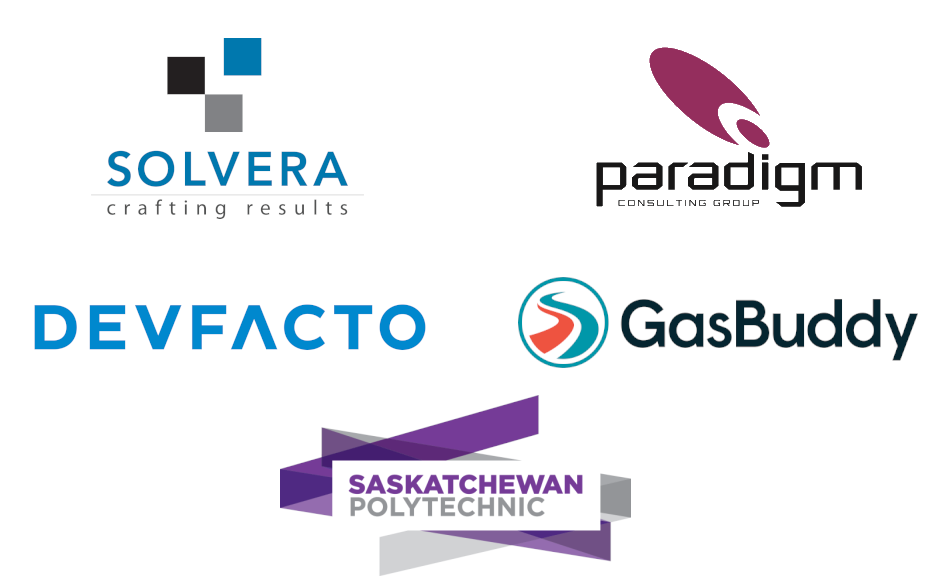

- title : Level Up with Generative Testing
- description : Adding generative testing to your repertoire.
- author : Shane Charles
- theme : night
- transition : default

***

### Level Up with Generative Testing 

***

### Thank You

***
<!-- .slide: class="two-floating-elements" -->
### About me

    <ul>
     <li>Shane Charles</li>
<li>White Light Computing, Inc.</li>
<li>Functional programming enthusiast</li>
<li>Board member for Full Stack MB</li>
</ul>

    type ContactType = | Twitter | Blog | GitHub

    let getContactInfo = function
      | Twitter -> "@dead_stroke"
      | Blog    -> "https://geekeh.com"
      | GitHub  -> "shanecharles"

***

### Our Path

- Generative testing
- Property based testing 
- Stateful testing
- Testing in the wild
- Wrap up

***
### Has anyone

- had day interrupted by a critical bug
- an evening
- weekend

---
### How'd they get past the tests?

We can't think of everything.

***
### Generative Testing

Getting computers to do the heavy lifting of coming up with test inputs so we don't have to.

---
### Generative Testing Types

- Property based testing
- Stateful testing (Model based testing)
- Random testing
  - Fuzzing 

***
### What does generative testing look like?

    open FsCheck

    let Addition_commutative_property (x: int, y: int) =
      x + y = y + x

---
### Python

    [lang=python]
    from hypothesis import given
    from hypothesis.strategies import integers
    
    @given(integers(), integers())
    def test_addition_commutative_property(x, y):
        assert x + y == y + x

---
### Clojure

    [lang=clojure]
    (require '[clojure.test.check.generators :as gen])
    (require '[clojure.test.check.properties :as prop])

    (def addition_commutative_property
      (prop/for-all [v (gen/tuple gen/int gen/int)]
       (let [x (first v)
             y (second v)]
        (= (+ x y) (+ y x)))))

---
### C#

    [lang=c#]
    using Xunit;
    using FsCheck.Xunit;

    namespace PropertyTests
    {
      public class AdditionProperties
      {
        [Property(EndSize = 1000)]
        public void Addition_commutative_property(int x, int y)
        {
          Assert.Equal(x + y, y + x);
        }
      }
    }

***
### Why should we?

- Looks for undiscovered bugs
- Deeper understanding of domain
- Generates variations we wouldn't

---
### When should we?

- Mission critical functions
- Complex solutions
  - Lots of input variations
- APIs
- End to end

---
### When not?

- Overly simple
- Minimal input variation
- Language primitives

***

### Property Based Testing

> Given a subset of inputs, there exists a property which dictates results with a common trait.

---
### Examples

    let Multiplication_even_property (EvenInt x) (y : int) =
        0 = (x * y) % 2 

---
### Demo

No more hand waving

---
### Property Patterns

- There and back
- Somethings never change
- Different paths same destination
- Test oracle

---
### Generators

Functions combined together to build complex or narrow input variations.

---
### Common generators

- choose
- elements
- frequency
- constant
- sample

---
### Demo

More code
(Don't forget C#)

---
### But we can generate random data in
### {unit testing framework}?

- Shrinking

---
#### Shrinking sounds slow?

- No
- Yes
- It depends
- It's worth it

---
### Demo

Shrinking FTW

***

### Once upon a time 

- Worker uses tag for identification
- Screen prompts available actions for shift
- Actions: 
  - Start floor
  - End floor
  - Start break
  - End break

---
### Finite State Machine

***

### Stateful Testing / Model based testing

Simplified model to test the larger

---
### What do we do

- Create model
 - Simplified representation
- Execute actions (specifications)
 - Model
 - System
- Check for divergence

---
### Demo

Stateful Testing

***
### Further inspection

---
### Missing state

***
### Question

Who thinks they can benefit from generative testing?

---
### Quviq QuickCheck

---
### What they found

- Tested +1,000,000 lines (C)
 - Using 20,000 lines (erlang)
 - Found +200 issues

- Specification errors
- Bugs 
- Incompatibility
 - Priority rollover

---
### Jepsen.io

- Testing distributed systems
- Exercise database CAP constraints
 - Consistency
 - Availability
 - Partition tolerant (network)

---
### Jepsen found 

- MongoDB
 - 2013: Major loss of data
 - 2015: Dirty reads and some data loss
- Elasticsearch
 - ~34% data loss
- Redis
 - ~56% write loss
- FaunaDB
 - Race conditions
- More at Jepsen.io

***
### Summary

- Better tests?
- Let the computer find the weird issues
- Test things hard to do by hand or regular testing
- Shrinking is awesome

---
### Final

> Property Based Testing finds more bugs with less effort

John Hughes

***

### Thank You

    type ContactType = | Twitter | Blog | GitHub

    let getContactInfo = function
      | Twitter -> "@dead_stroke"
      | Blog    -> "https://geekeh.com"
      | GitHub  -> "shanecharles"

***
